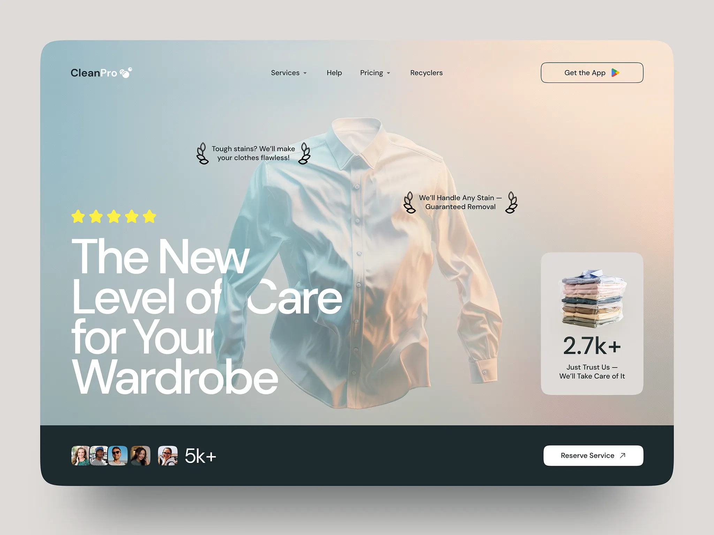
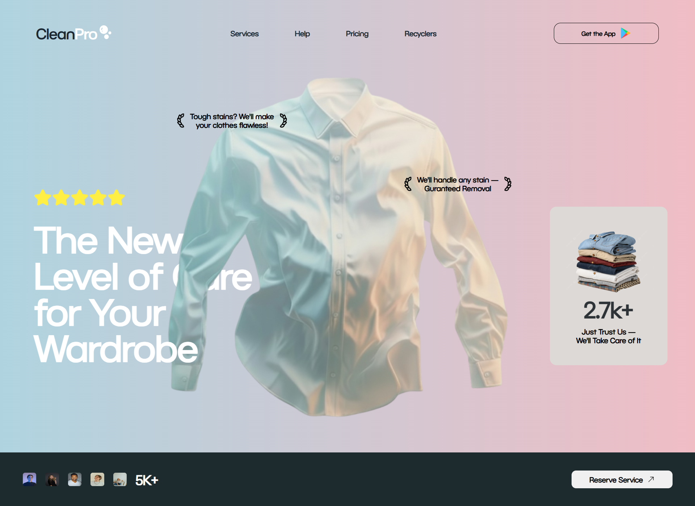

# CleanPro Home Page Clone

This project is a part of **Daily Challenge 01**: Cloning the CleanPro home page design using only HTML and CSS. The goal was to replicate the provided design as closely as possible, focusing on layout, typography, and visual elements. No responsiveness or JavaScript functionality has been implemented.

## Project Overview

- **Task:** Clone the CleanPro home page design
- **Technologies Used:** HTML, CSS (no frameworks, no JavaScript)
- **Design Reference:** See `original-e007cf174b7030ef3b9ece3cea0c69b1.webp` for the original design
- **Status:** Static desktop version (not responsive)

## Features

- Pixel-perfect layout based on the provided design
- Custom fonts and images for accurate visual replication
- Organized folder structure for assets (fonts, images)

## Folder Structure

```
Project/
│
├── index.html
├── style.css
├── original-e007cf174b7030ef3b9ece3cea0c69b1.webp  # Design reference
│
├── font/
│   ├── BC_Novatica_CYR_Regular.otf
│   └── desktop.ini
│
└── images/
    ├── a-pristine-white-long-sleeve-button-down-dress-shirt-mockup-free-png.webp
    ├── app.png
    ├── arrow.png
    ├── bubble.png
    ├── Bulk_shirts.png
    ├── Floating_shirt.webp
    ├── laurel_wreath-left.png
    ├── laurel_wreath-right.png
    └── rating.png
```

## How to View

1. **Clone the repository:**
   ```sh
   git clone https://github.com/AdityaHemantBhat/Cohort-2-Daily_Task_01.git
   ```
2. **Open `index.html` in your browser.**

## Screenshots

| Original Design | Cloned Version |
|----------------|---------------|
|  |  |

## Credits

- **Design Reference:** CleanPro Home Page (see original image)
- **Author:** Aditya Hemant Bhat

---

> This project is for educational purposes only. All assets are used for learning and demonstration.
