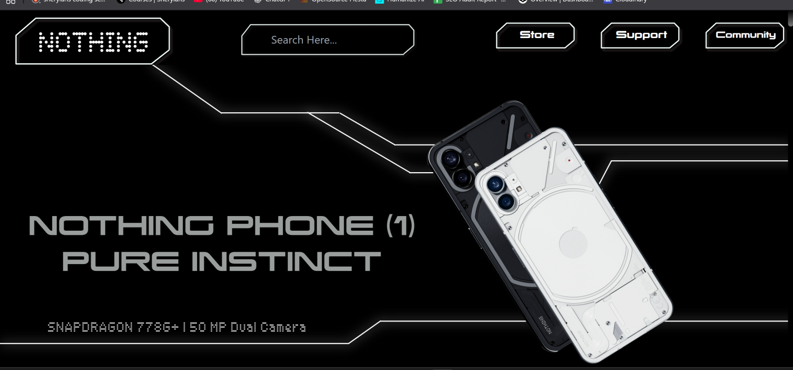
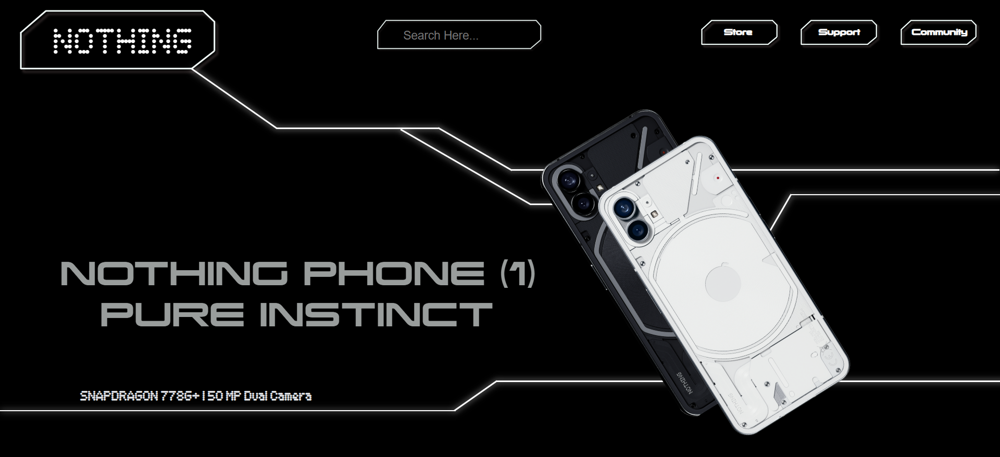

# Daily Challenge 02: Cloning "Nothing" Design



## Project Overview
This project is a solution to the "Daily Challenge 02" where the goal was to clone the "Nothing" design using only HTML and CSS. The design reference is provided in `image.webp`, and the completed clone can be seen in `Clone_nothing.png`.

- **Responsive:** The layout adapts to different screen sizes for a seamless experience on all devices.
- **No JavaScript:** Built entirely with HTML and CSS.
- **Minimal & Clean:** Focused on replicating the design as closely as possible.

---

## 🚀 Getting Started
1. **Clone the repository:**
   ```sh
   git clone https://github.com/AdityaHemantBhat/Cohort-2-Daily_Task_02
   ```
2. **Open `index.html` in your browser.**

---

## 📁 Folder Structure
```
├── assets/      # Images, SVGs, and design assets
├── font/        # Custom fonts used in the project
├── index.html   # Main HTML file
├── style.css    # Main CSS file
```

---

## 🖼️ Design Reference & Clone
- **Reference:** 
- **Clone:** 

---

## ✨ Features
- Pixel-perfect design clone
- Responsive layout
- Custom fonts
- Clean and organized code

---

## 📦 Assets & Credits
- All images and SVGs are in the `assets/` folder.
- Fonts are in the `font/` folder.
- Design inspired by the "Nothing" challenge.

---

## 📱 Responsive Preview
The project is fully responsive. Try resizing your browser or viewing on mobile for the best experience!

---

## 🛠️ Built With
- HTML5
- CSS3

---

## 🙌 Author
- **Aditya Hemant Bhat**

---

## ⭐️ Show your support
If you like this project, please ⭐️ the repo and share it!

---

## 📬 Contact
For any questions or feedback, feel free to open an issue or contact me.

---

## 📚 License
This project is for educational purposes only.

---

<p align="center">
  
  
  
</p>
