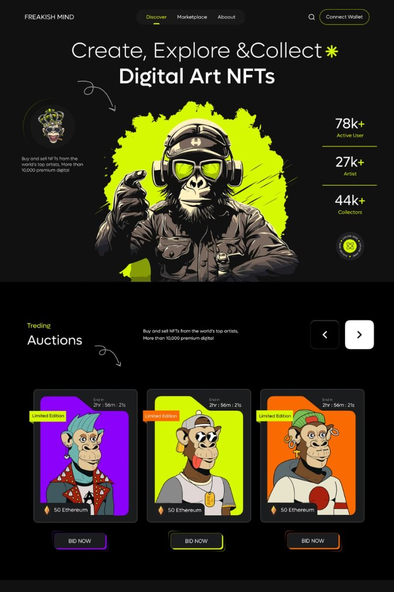
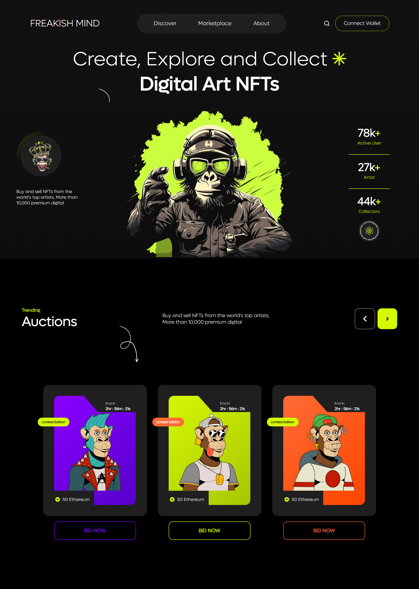

# 🧠 Daily Challenge 03: Freakish Mind Design Clone

Welcome to **Daily Challenge 03**! This project is a pixel-perfect, responsive HTML & CSS clone of the "Freakish Mind" design. The original design and the completed clone are both included for reference.

---

## 🖼️ Project Preview

| Original Design | My Clone |
|:--------------:|:--------:|
|  |  |

---

## 🚀 Features

- 🎨 **Pure HTML & CSS** (no frameworks)
- 📱 **Fully Responsive**
- 🖼️ **Pixel-perfect clone**
- 🗂️ **Minimal, clean structure**

---

## 📁 Folder Structure

```
├── index.html
├── style.css
├── assets/
│   ├── arrow.gif
│   ├── asterisk.png
│   ├── atom.png
│   ├── atomic-game-engine_100772.webp
│   ├── brain.png
│   ├── down-arrow.svg
│   ├── hero.webp
│   ├── m2.webp
│   ├── Mokey-01.png
│   ├── Mokey-02.png
│   ├── Monkey_crawn.png
│   ├── Monkey-03.png
│   └── Smart-City-3-routes.xlsx
├── font/
│   ├── LufgaLight.ttf
│   └── LufgaRegular.ttf
```

---

## 🛠️ How to Use

1. **Clone this repo**
2. Open `index.html` in your browser
3. Enjoy the design!

---

## 📦 Assets & Icons

All images and icons used are in the `assets/` folder. Fonts are in the `font/` folder.

- [arrow.gif](assets/arrow.gif)
- [asterisk.png](assets/asterisk.png)
- [atom.png](assets/atom.png)
- [atomic-game-engine_100772.webp](assets/atomic-game-engine_100772.webp)
- [brain.png](assets/brain.png)
- [down-arrow.svg](assets/down-arrow.svg)
- [hero.webp](assets/hero.webp)
- [m2.webp](assets/m2.webp)
- [Mokey-01.png](assets/Mokey-01.png)
- [Mokey-02.png](assets/Mokey-02.png)
- [Monkey_crawn.png](assets/Monkey_crawn.png)
- [Monkey-03.png](assets/Monkey-03.png)

---

## ✨ Credits

- **Design inspiration:** Freakish Mind
- **Clone by:** [Your Name]

---

## 📱 Responsive Design

This project is fully responsive and works on all devices. Resize your browser to check it out!

---

## ⭐️ Show your support

If you like this project, please ⭐️ the repo!

---

## 📝 License

This project is for educational purposes only.
